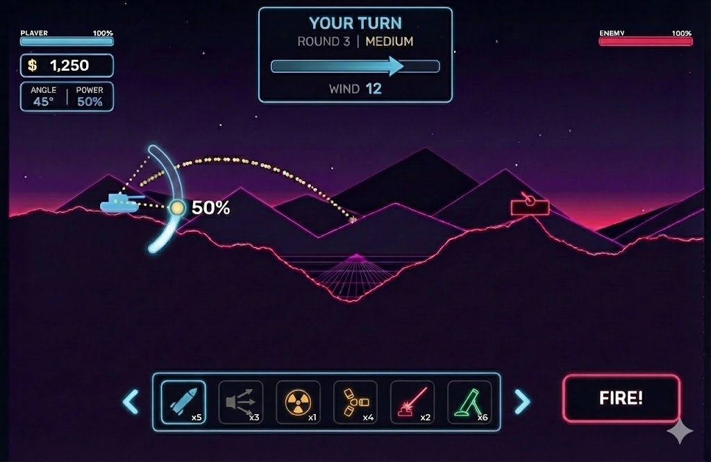

# HUD Redesign Specification

## Reference Mockup



*This mockup shows the target layout - not pixel-perfect, but captures the overall structure and feel we're aiming for.*

---

## Overview

A complete reorganization of the in-game HUD for improved clarity, mobile ergonomics, and reduced visual clutter. The redesign consolidates information into logical groups and optimizes for touch-based gameplay on iOS.

---

## Design Principles

1. **Mobile-First** - Designed for phone held in landscape, thumb-reachable controls
2. **Information Hierarchy** - Most important info is largest and most prominent
3. **Declutter** - Remove redundant elements, reduce visual noise
4. **Logical Grouping** - Related information grouped together spatially

---

## Layout Zones

```
┌─────────────────────────────────────────────────────────────────┐
│ [PLAYER INFO]          [GAME STATE]              [ENEMY INFO]  │
│  Top-Left              Top-Center                 Top-Right    │
├─────────────────────────────────────────────────────────────────┤
│                                                                 │
│                                                                 │
│                      GAMEPLAY AREA                              │
│                                                                 │
│                                                                 │
├─────────────────────────────────────────────────────────────────┤
│        [WEAPON SELECTION BAR]                    [FIRE BTN]    │
│         Bottom-Center                            Bottom-Right  │
└─────────────────────────────────────────────────────────────────┘
```

---

## Top-Center: Game State Panel

**Purpose:** Display all information about the current game state (not player-specific)

### Components

#### 1. Turn Indicator
- Large, glowing text: `YOUR TURN` or `ENEMY TURN`
- Prominent visibility - player should always know whose turn it is
- Glow color matches current player (cyan for player, pink for enemy)

#### 2. Round & Difficulty
- Displayed below turn indicator
- Format: `ROUND 3 | MEDIUM`
- Smaller text than turn indicator
- Shows progression context

#### 3. Wind Indicator (Redesigned)
- Horizontal bar below round info
- Visual elements:
  - Bar with fill level indicating wind strength
  - Large arrow inside bar showing direction (left or right)
  - Numerical value below: `WIND 12`
- Arrow length/size scales with wind strength
- Zero wind = short centered double-arrow or "WIND 0" with no directional arrow

### Visual Style
```
┌─────────────────────────────┐
│        YOUR TURN            │  ← Large, glowing text
│     ROUND 3 | MEDIUM        │  ← Smaller subtext
│  ┌───────────────────────┐  │
│  │    ────────►          │  │  ← Wind bar with arrow
│  └───────────────────────┘  │
│         WIND 12             │  ← Numerical value
└─────────────────────────────┘
```

---

## Top-Left: Player Information Panel

**Purpose:** All player-specific data in one consolidated location

### Components (Top to Bottom)

#### 1. Player Health Bar
- Label: `PLAYER`
- Percentage display: `100%`
- Horizontal bar with fill
- Color: Cyan/blue (player color)

#### 2. Currency Display
- Format: `$ 1,250`
- Prominent but smaller than health
- Neon glow effect

#### 3. Aiming Data (Compact)
- Two-column box showing current values
- Format: `ANGLE 45° | POWER 50%`
- Compact single-line display
- Updates in real-time as player adjusts

### Visual Style
```
┌──────────────────┐
│ PLAYER     100%  │  ← Health bar
│ ████████████████ │
├──────────────────┤
│ $ 1,250          │  ← Currency
├──────────────────┤
│ ANGLE  │ POWER   │  ← Aiming data
│  45°   │  50%    │
└──────────────────┘
```

### Removals
- Remove separate large ANGLE display box
- Remove separate large POWER display box
- Remove "1.2x BONUS" indicator (or relocate if needed for roguelike mode)

---

## Top-Right: Enemy Information

**Purpose:** Enemy status at a glance

### Components

#### 1. Enemy Health Bar
- Label: `ENEMY`
- Percentage display: `100%`
- Horizontal bar with fill
- Color: Pink/red (enemy color)
- Mirrors player health bar style

### Visual Style
```
┌──────────────────┐
│ ENEMY      100%  │
│ ████████████████ │
└──────────────────┘
```

---

## Bottom-Center: Weapon Selection Bar

**Purpose:** Easy weapon switching with visual inventory

### Components

#### 1. Weapon Icons
- Horizontal row of weapon icons
- Each icon shows:
  - Weapon visual (icon/sprite)
  - Ammo count below (e.g., `x5`, `x3`, `∞`)
- Currently selected weapon is highlighted (brighter glow, border)

#### 2. Navigation Arrows
- Left arrow `<` and right arrow `>` on sides
- For scrolling if more weapons than fit on screen
- Touch targets should be generously sized

### Behavior
- Tap weapon icon to select
- Swipe left/right to scroll through weapons
- Selected weapon has prominent highlight
- Weapons with 0 ammo are grayed out

### Visual Style
```
┌───────────────────────────────────────────────┐
│  <  │ 🚀  │ ⚡  │ ☢️  │ 💣  │ 🔥  │ 🎯  │  >  │
│     │ x5  │ x3  │ x1  │ x4  │ x2  │ x6  │     │
└───────────────────────────────────────────────┘
        ▲
        └── Selected weapon highlighted
```

### Removals
- Remove old weapon selection box from top-right
- Remove "TAP TO SWITCH" / "TAB: SWITCH" text

---

## Bottom-Right: Fire Button

**Purpose:** Primary action button, optimized for right-thumb access

### Components

#### 1. Fire Button
- Large, prominent button
- Text: `FIRE!`
- Color: Red/pink glow (distinct from other UI)
- Positioned for easy right-thumb tap on mobile

### Changes from Current
- **Moved** from bottom-center to bottom-right
- **Removed** `[SPACE]` keyboard hint text
- Size remains large and prominent

### Visual Style
```
┌─────────────┐
│             │
│   FIRE!     │  ← Red glow, large touch target
│             │
└─────────────┘
```

---

## Gameplay Element Changes

### 1. Aiming Arc Declutter
- **Current:** Angle labels (90°, 135°, 180°) at full opacity
- **Change:** Make angle labels semi-transparent (30-40% opacity)
- **Reason:** Reduces visual noise, lets trajectory line stand out
- Only highlight/brighten the label nearest to current aim angle (optional)

### 2. Trajectory Line Shortening
- **Current:** Full trajectory shown including landing spot
- **Change:** Only show initial ~20-30% of trajectory arc
- **Reason:**
  - Increases skill requirement (player must estimate)
  - More satisfying when shots land
  - Matches classic artillery game feel
- **Implementation:** Cap the number of trajectory dots rendered
- **Future consideration:** Full trajectory as purchasable "Guidance System" item

### 3. Power Indicator on Arc
- Show current power percentage near the tank's aim arc
- Format: `50%` floating near the trajectory start
- Updates in real-time as power changes

---

## Removals Summary

| Element | Location | Reason |
|---------|----------|--------|
| Large ANGLE box | Left side | Consolidated into compact aiming data |
| Large POWER box | Left side | Consolidated into compact aiming data |
| "1.2x BONUS" text | Top-left | Unclear purpose, remove or relocate |
| Old weapon box | Top-right | Replaced by bottom weapon bar |
| "TAP TO SWITCH" text | Weapon box | No longer needed with icon bar |
| `[SPACE]` hint | Fire button | Mobile-first, remove keyboard hints |
| Bottom help text | Bottom-center | Clutters UI, not needed for mobile |
| Pause button overlap | Top-left | Ensure proper spacing |

---

## Responsive Considerations

### Mobile (Primary Target)
- All touch targets minimum 44x44 points
- Fire button easily reachable by right thumb
- Weapon bar scrollable if needed
- No keyboard hints shown

### Desktop (Secondary)
- Keyboard shortcuts still functional (just not displayed on HUD)
- Mouse hover states on buttons
- Could show keyboard hints in a separate help overlay (not on main HUD)

---

## Color Reference

| Element | Color | Hex |
|---------|-------|-----|
| Player elements | Cyan | #05d9e8 |
| Enemy elements | Pink/Red | #ff2a6d |
| Fire button | Red glow | #ff2a6d |
| Currency | Yellow/Gold | #f9f002 |
| Panel backgrounds | Dark translucent | rgba(10, 10, 26, 0.85) |
| Panel borders | Cyan glow | #05d9e8 |
| Selected weapon | Bright cyan | #05d9e8 |

---

## Implementation Priority

### Phase 1: Layout Restructure
1. Create top-center game state panel
2. Consolidate player info to top-left
3. Move fire button to bottom-right
4. Create bottom weapon bar structure

### Phase 2: Component Implementation
5. Implement new wind indicator with bar and number
6. Implement compact angle/power display
7. Implement weapon icon bar with selection
8. Add round/difficulty display

### Phase 3: Polish & Cleanup
9. Remove old UI elements
10. Shorten trajectory line
11. Fade angle arc labels
12. Adjust spacing and sizing for mobile

---

## Weapon Icon Assets

### Requirements

Each weapon type needs its own icon graphic for the weapon selection bar. Icons should be:
- Individual image files (easy to swap out later)
- Consistent size (e.g., 64x64 or 48x48 pixels)
- Transparent background (PNG)
- Visually distinct from each other

### Asset Structure

Add to `assets/manifest.json`:

```json
"weaponIcons": {
  "basic": { "path": "images/ui/weapon-icon-basic.png", "width": 64, "height": 64 },
  "missile": { "path": "images/ui/weapon-icon-missile.png", "width": 64, "height": 64 },
  "bigshot": { "path": "images/ui/weapon-icon-bigshot.png", "width": 64, "height": 64 },
  "mirv": { "path": "images/ui/weapon-icon-mirv.png", "width": 64, "height": 64 },
  "deathshead": { "path": "images/ui/weapon-icon-deathshead.png", "width": 64, "height": 64 },
  "roller": { "path": "images/ui/weapon-icon-roller.png", "width": 64, "height": 64 },
  "heavyroller": { "path": "images/ui/weapon-icon-heavyroller.png", "width": 64, "height": 64 },
  "digger": { "path": "images/ui/weapon-icon-digger.png", "width": 64, "height": 64 },
  "heavydigger": { "path": "images/ui/weapon-icon-heavydigger.png", "width": 64, "height": 64 },
  "mininuke": { "path": "images/ui/weapon-icon-mininuke.png", "width": 64, "height": 64 },
  "nuke": { "path": "images/ui/weapon-icon-nuke.png", "width": 64, "height": 64 }
}
```

### Placeholder Strategy

For initial implementation, generate simple geometric placeholders:
- Each weapon gets a distinct shape/color
- Rendered programmatically to canvas, then saved as PNG
- Or drawn directly if image not found (fallback)

Example placeholder concepts:
| Weapon | Placeholder Shape | Color |
|--------|------------------|-------|
| Basic | Simple circle | Cyan |
| Missile | Elongated triangle | Orange |
| Big Shot | Large circle | Yellow |
| MIRV | Star/asterisk | Purple |
| Death's Head | Skull shape or 9-dot pattern | Red |
| Roller | Circle with spikes | Green |
| Heavy Roller | Larger spiked circle | Dark green |
| Digger | Drill/arrow down | Brown |
| Heavy Digger | Larger drill | Dark brown |
| Mini Nuke | Small radiation symbol | Yellow |
| Nuke | Large radiation symbol | Orange/red |

### Swapping for Production Art

When custom art is ready (via NanoBanana or other):
1. Drop new PNG files into `assets/images/ui/`
2. Keep same filenames (e.g., `weapon-icon-nuke.png`)
3. Update dimensions in manifest.json if sizes change
4. No code changes needed

---

## Mockup Reference

The target design consolidates information and improves mobile ergonomics:

- **Top-left:** Player health, money, angle/power (compact)
- **Top-center:** Turn indicator, round info, wind bar with number
- **Top-right:** Enemy health only
- **Bottom-center:** Horizontal weapon icon bar with ammo counts
- **Bottom-right:** Large FIRE button for right-thumb access
