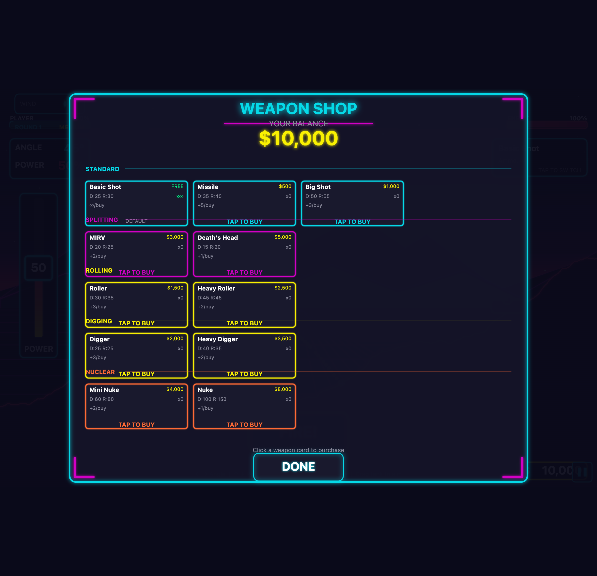

# Shop UI Redesign Specification

## Reference Screenshot



*Current shop showing layout issues: overlapping sections, oversized cards, cluttered information.*

---

## Overview

Redesign the weapon shop UI to fix layout issues, improve visual hierarchy, and prepare for future expansion (more weapons, items). The shop should be clean, intuitive, and support scrolling as content grows.

---

## Current Problems

1. **Overlapping Sections** - Category labels (SPLITTING, ROLLING, etc.) overlap into adjacent weapon cards
2. **Oversized Cards** - Each weapon card is larger than necessary
3. **Cluttered Information** - Too much text (D:25 R:30, +2/buy, etc.)
4. **Redundant Helper Text** - "Click a weapon card to purchase" is unnecessary
5. **Missing Weapon Graphics** - No visual icons, just text
6. **No Scroll Support** - Can't handle more weapons gracefully
7. **No Tab Navigation** - Can't separate weapons from future items

---

## Design Goals

1. **Clean Layout** - Proper spacing, no overlapping
2. **Visual Focus** - Weapon icon + name + price (minimal text)
3. **Scalable** - Scrollable rows and lists for future expansion
4. **Intuitive** - No helper text needed, obvious interactions
5. **Mobile-Friendly** - Touch-friendly card sizes and scrolling

---

## Layout Structure

```
┌─────────────────────────────────────────────────────────────┐
│                      WEAPON SHOP                            │
│                    YOUR BALANCE: $1,744                     │
├─────────────────────────────────────────────────────────────┤
│  [ WEAPONS ]  [ ITEMS ]                    ← Tab Navigation │
├─────────────────────────────────────────────────────────────┤
│                                                             │
│  STANDARD ─────────────────────────────────────────────     │
│  ┌────────┐ ┌────────┐ ┌────────┐                          │
│  │  icon  │ │  icon  │ │  icon  │  →  (scroll indicator)   │
│  │ Basic  │ │Missile │ │Big Shot│                          │
│  │  FREE  │ │  $500  │ │ $1,000 │                          │
│  │  x∞    │ │  x5    │ │  x0    │                          │
│  └────────┘ └────────┘ └────────┘                          │
│                                                             │
│  SPLITTING ────────────────────────────────────────────     │
│  ┌────────┐ ┌────────┐                                     │
│  │  icon  │ │  icon  │                                     │
│  │  MIRV  │ │Death's │                                     │
│  │ $3,000 │ │ $5,000 │                                     │
│  │  x0    │ │  x0    │                                     │
│  └────────┘ └────────┘                                     │
│                                                             │
│  (more categories below - vertical scroll)                  │
│                                                             │
├─────────────────────────────────────────────────────────────┤
│                      [ DONE ]                               │
└─────────────────────────────────────────────────────────────┘
```

---

## Component Specifications

### 1. Header Section

- **Title:** "WEAPON SHOP" - large, centered, neon glow
- **Balance:** "YOUR BALANCE: $X,XXX" - prominent display below title
- Balance updates immediately when purchases are made

### 2. Tab Navigation

- Two tabs: **WEAPONS** and **ITEMS**
- Active tab is highlighted (glow, underline, or filled)
- Items tab can show "Coming Soon" or be disabled initially
- Tabs are touch-friendly (minimum 44px height)

### 3. Category Sections

Each weapon category (STANDARD, SPLITTING, ROLLING, DIGGING, NUCLEAR) is a distinct section:

- **Category Header:** Label with horizontal line extending to the right
- **Weapon Row:** Horizontal row of weapon cards
- **Spacing:** Clear padding/margin between categories (minimum 20px)
- **Containment:** Category content must not overflow into adjacent sections

### 4. Weapon Cards (Redesigned)

Compact cards with essential info only:

```
┌──────────────┐
│    [ICON]    │  ← Weapon graphic (from weapon icons asset)
│              │
│  Weapon Name │  ← Name (truncate if too long)
│    $1,500    │  ← Price (large, prominent) or "FREE"
│     x3       │  ← Current inventory count
└──────────────┘
```

**Card States:**
- **Available:** Normal appearance, tappable
- **Owned (x > 0):** Subtle highlight or checkmark
- **Can't Afford:** Grayed out, "NO FUNDS" badge
- **Selected/Hover:** Glow border effect

**Removed from cards:**
- Damage/radius stats (D:25 R:30) - too cluttered
- "+X/buy" text - not essential
- "TAP TO BUY" text - obvious from context

**Card Size:**
- Smaller than current (~100-120px wide)
- Consistent height across all cards
- Touch-friendly tap target

### 5. Scrolling Behavior

#### Horizontal Scroll (Per Row)
- Each category row scrolls horizontally if weapons overflow
- **No visible scrollbar**
- Visual indicator when more content exists:
  - Fade gradient on edges, OR
  - Small arrow indicator (< >)
- Touch: swipe to scroll
- Desktop: drag or scroll wheel (when hovering row)

#### Vertical Scroll (Entire List)
- Category list scrolls vertically if it exceeds container height
- **No visible scrollbar**
- Visual indicator: fade at bottom or subtle arrow
- Smooth scrolling behavior

### 6. Footer Section

- **DONE Button:** Large, centered, prominent
- Closes shop and returns to gameplay
- Remove "Click a weapon card to purchase" helper text

---

## Interaction Behavior

### Purchasing
1. Tap weapon card
2. If affordable: Purchase immediately, update balance, update inventory count
3. If not affordable: Brief shake animation or flash "NO FUNDS"
4. Audio feedback: purchase sound or error sound

### Tab Switching
1. Tap tab to switch view
2. Smooth transition between WEAPONS and ITEMS content
3. Scroll position resets when switching tabs

### Scrolling
- Touch: swipe gestures
- Desktop: mouse wheel, click-drag
- Momentum scrolling for natural feel

---

## Visual Style

Maintain synthwave aesthetic:

| Element | Style |
|---------|-------|
| Background | Dark translucent panel (rgba(10, 10, 26, 0.95)) |
| Borders | Neon glow (cyan/pink) |
| Category headers | Cyan text with horizontal line |
| Card borders | Subtle glow, brighter on hover/select |
| Prices | Yellow/gold color, larger font |
| "NO FUNDS" | Red/pink text |
| Tabs | Glowing underline for active state |

---

## Weapon Icons Dependency

This redesign requires weapon icon graphics from the HUD Redesign spec:

- Icons defined in `assets/manifest.json` under `weaponIcons`
- Each weapon displays its corresponding icon in the card
- Falls back to placeholder if icon not loaded

**Blocked by:** HUD Redesign epic (specifically weapon icon implementation)

---

## Future Considerations

### Items Tab
When implemented, ITEMS tab could include:
- Shields
- Parachutes
- Guidance systems
- Batteries/Fuel
- Other accessories from original game

### Selling
- Future: ability to sell back items at reduced price
- Would need "SELL" mode or long-press to sell

### Weapon Details
- Future: tap-and-hold or info button for detailed stats
- Shows damage, radius, description in a popup

---

## Removals Summary

| Element | Reason |
|---------|--------|
| "Click a weapon card to purchase" | Obvious, unnecessary |
| D:XX R:XX stats on cards | Cluttered, not essential |
| "+X/buy" text | Cluttered |
| Large card size | Wasted space |
| Visible scrollbars | Cleaner without them |

---

## Implementation Priority

### Phase 1: Fix Layout Issues
1. Proper category containment and spacing
2. Resize weapon cards (smaller)
3. Remove cluttered text from cards

### Phase 2: Add Visual Elements
4. Integrate weapon icons (after HUD epic complete)
5. Add tab navigation structure
6. Style cards with new layout (icon, name, price, count)

### Phase 3: Scrolling & Polish
7. Implement horizontal scroll per row
8. Implement vertical scroll for list
9. Add scroll indicators (no scrollbars)
10. Remove helper text
11. Polish animations and transitions
